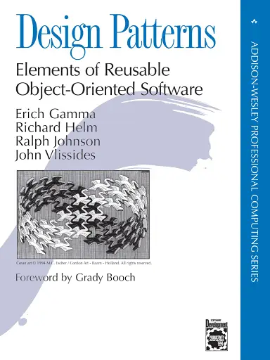

# **Patrones de Diseño**

> *"Design Patterns: Elements of Reusable Object-Oriented Software"* de **Erich Gamma**, **Richard Helm**, **Ralph Johnson** y **John Vlissides**, conocidos como el **"Gang of Four" (GoF)**.

Los patrones de diseño son **soluciones reutilizables** a problemas comunes que surgen durante el desarrollo de software. Ayudan a los desarrolladores a estructurar su código de manera **más flexible, reutilizable y mantenible**.

## **Patrones Creacionales**

Estos patrones se enfocan en la creación de objetos, con el objetivo de hacerla flexible y eficiente.

- **Singleton:** Asegura que una clase tenga solo una instancia y proporciona un punto de acceso global a ella.
- **Factory Method (Método de Fábrica):** Permite crear objetos sin especificar la clase exacta del objeto a crear.
- **Abstract Factory (Fábrica Abstracta):** Proporciona una interfaz para crear familias de objetos relacionados sin especificar sus clases concretas.
- **Builder (Constructor):** Separa la construcción de un objeto complejo de su representación, permitiendo diferentes representaciones del mismo tipo de objeto.
- **Prototype (Protótipo):** Permite crear nuevos objetos copiando un objeto existente, en lugar de crear uno nuevo desde cero.

## **Patrones Estructurales**

Estos patrones tratan sobre cómo se componen las clases y los objetos para formar estructuras más grandes manteniendo flexibilidad y eficiencia.

- **Adapter (Adaptador):** Permite que interfaces incompatibles trabajen juntas.
- **Bridge (Puente):** Desacopla una abstracción de su implementación, permitiendo que ambas evolucionen independientemente.
- **Composite (Composición):** Permite tratar objetos individuales y composiciones de objetos de manera uniforme.
- **Decorator (Decorador):** Añade responsabilidades adicionales a un objeto de manera dinámica.
- **Facade (Fachada):** Proporciona una interfaz simplificada a un conjunto de interfaces en un subsistema.
- **Flyweight (Peso Ligero):** Comparte objetos de manera eficiente para ahorrar memoria, especialmente cuando se crean muchos objetos similares.
- **Proxy (Proxy):** Controla el acceso a un objeto, a menudo añadiendo funcionalidades adicionales como control de acceso o almacenamiento en caché.

## **Patrones de Comportamiento**

Estos patrones se enfocan en cómo los objetos interactúan y se comunican entre sí.

- **Chain of Responsibility (Cadena de Responsabilidad):** Pasa una solicitud a lo largo de una cadena de manejadores, donde cada uno decide si manejarla o pasarla a otro.
- **Command (Comando):** Encapsula una solicitud como un objeto, permitiendo pasar parámetros a clientes con diferentes solicitudes.
- **Interpreter (Intérprete):** Proporciona una manera de evaluar sentencias en un lenguaje, a menudo utilizado en compiladores o intérpretes de lenguajes.
- **Iterator (Iterador):** Permite acceder a los elementos de una colección sin exponer su estructura interna.
- **Mediator (Mediador):** Define un objeto que centraliza la comunicación entre varios objetos, promoviendo un bajo acoplamiento.
- **Memento (Memento):** Permite capturar y restaurar el estado de un objeto sin violar la encapsulación.
- **Observer (Observador):** Define una dependencia uno a muchos entre objetos, de modo que cuando un objeto cambia de estado, todos los objetos dependientes son notificados y actualizados automáticamente.
- **State (Estado):** Permite que un objeto altere su comportamiento cuando cambia su estado interno.
- **Strategy (Estrategia):** Define una familia de algoritmos, encapsula cada uno de ellos y los hace intercambiables.
- **Template Method (Método de Plantilla):** Define el esqueleto de un algoritmo en un método, permitiendo que las subclases implementen algunos pasos.
- **Visitor (Visitante):** Añade operaciones a una estructura de objetos sin modificar los objetos en sí.

### **Beneficios**

- **Reutilización de Código:** Proporcionan soluciones comprobadas que pueden aplicarse a diferentes contextos.
- **Mantenibilidad:** Facilitan la comprensión y modificación de sistemas al estandarizar soluciones.
- **Mejora en la Comunicación:** Ayudan a los desarrolladores a hablar el mismo "lenguaje" al referirse a soluciones comunes.
