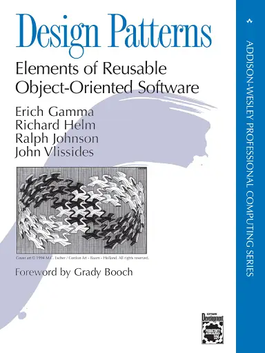

# **Design Patterns**

> *"Design Patterns: Elements of Reusable Object-Oriented Software"* by **Erich Gamma**, **Richard Helm**, **Ralph Johnson**, and **John Vlissides**, known as the **"Gang of Four" (GoF)**.

Design patterns are **reusable solutions** to common problems that arise during software development. They help developers structure their code in a way that is **more flexible, reusable, and maintainable**.

## **Creational Patterns**

These patterns focus on object creation, aiming to make it flexible and efficient.

- **Singleton:** Ensures that a class has only one instance and provides a global access point to it.
- **Factory Method:** Allows for creating objects without specifying the exact class of the object to be created.
- **Abstract Factory:** Provides an interface for creating families of related objects without specifying their concrete classes.
- **Builder:** Separates the construction of a complex object from its representation, allowing for different representations of the same type of object.
- **Prototype:** Allows for creating new objects by copying an existing object, rather than creating a new one from scratch.

## **Structural Patterns**

These patterns deal with how classes and objects are composed to form larger structures while maintaining flexibility and efficiency.

- **Adapter:** Allows incompatible interfaces to work together.
- **Bridge:** Decouples an abstraction from its implementation, allowing both to evolve independently.
- **Composite:** Allows you to treat individual objects and compositions of objects uniformly.
- **Decorator:** Adds additional responsibilities to an object dynamically.
- **Facade:** Provides a simplified interface to a set of interfaces in a subsystem.
- **Flyweight:** Shares objects efficiently to save memory, especially when many similar objects are created.
- **Proxy:** Controls access to an object, often adding extra functionality like access control or caching.

## **Behavioral Patterns**

These patterns focus on how objects interact and communicate with each other.

- **Chain of Responsibility:** Passes a request along a chain of handlers, where each one decides whether to handle it or pass it along.
- **Command:** Encapsulates a request as an object, allowing parameters to be passed to clients with different requests.
- **Interpreter:** Provides a way to evaluate sentences in a language, often used in language compilers or interpreters.
- **Iterator:** Allows access to the elements of a collection without exposing its internal structure.
- **Mediator:** Defines an object that centralizes communication between various objects, promoting loose coupling.
- **Memento:** Allows capturing and restoring an object’s state without violating encapsulation.
- **Observer:** Defines a one-to-many dependency between objects, so when one object changes state, all dependent objects are notified and updated automatically.
- **State:** Allows an object to alter its behavior when its internal state changes.
- **Strategy:** Defines a family of algorithms, encapsulates each one, and makes them interchangeable.
- **Template Method:** Defines the skeleton of an algorithm in a method, allowing subclasses to implement some steps.
- **Visitor:** Adds operations to an object structure without modifying the objects themselves.

### **Benefits**

- **Code Reusability:** They provide proven solutions that can be applied to different contexts.
- **Maintainability:** They make systems easier to understand and modify by standardizing solutions.
- **Improved Communication:** They help developers speak the same "language" when referring to common solutions.
